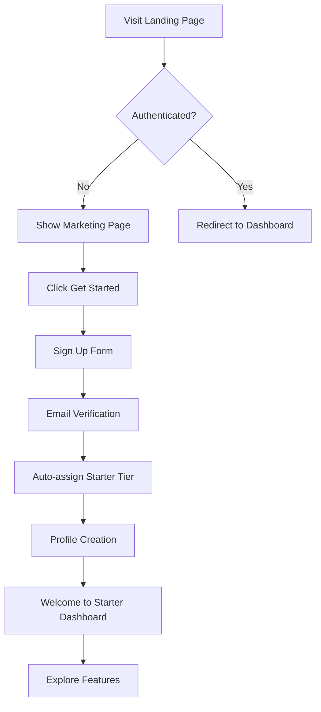
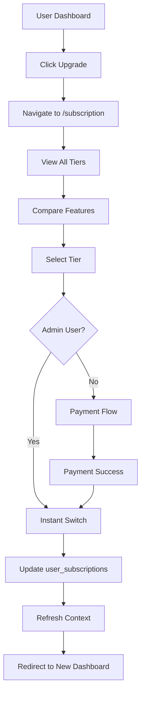
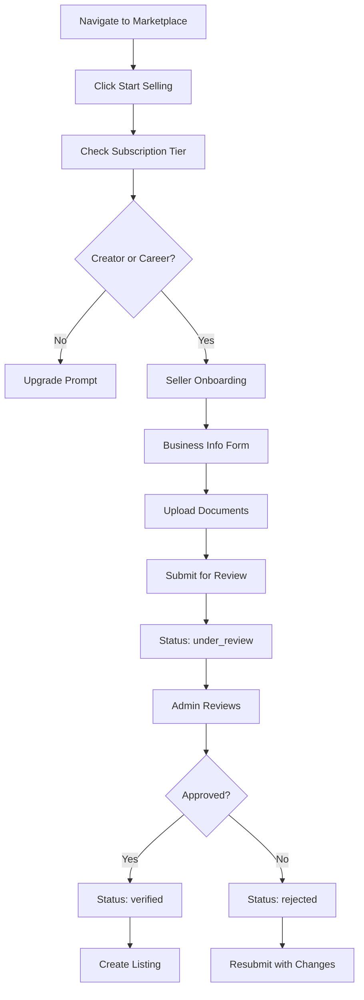
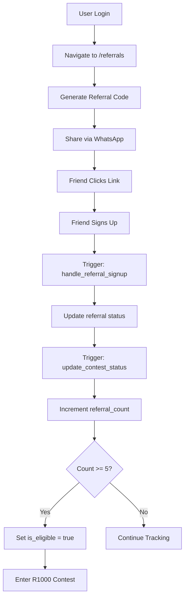
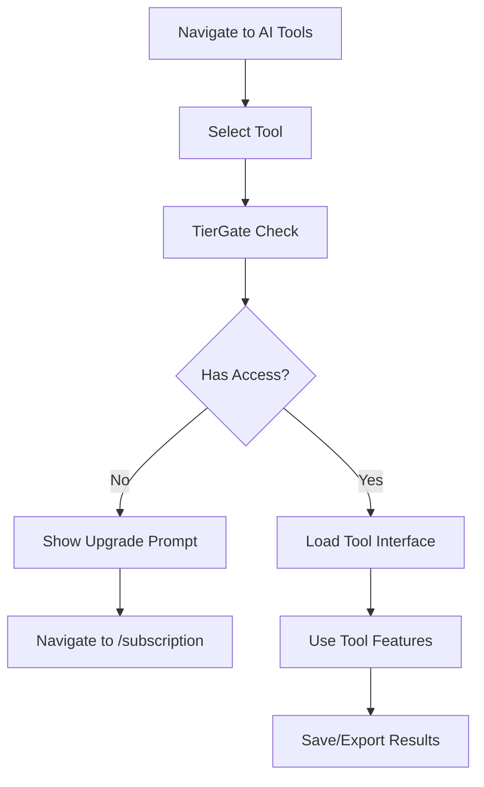

# Product Requirements Document (PRD)
# Digital Intelligence Marketplace

**Version:** 1.0  
**Last Updated:** 2025-10-07  
**Platform Tagline:** Learn, Build & Earn with AI

---

## Table of Contents
1. [Executive Summary](#1-executive-summary)
2. [Product Vision & Goals](#2-product-vision--goals)
3. [User Personas & Roles](#3-user-personas--roles)
4. [Subscription Tiers](#4-subscription-tiers)
5. [Core Features](#5-core-features)
6. [Technical Architecture](#6-technical-architecture)
7. [Database Schema](#7-database-schema)
8. [User Flows](#8-user-flows)
9. [Security & Permissions](#9-security--permissions)
10. [Integration Points](#10-integration-points)
11. [Success Metrics](#11-success-metrics)

---

## 1. Executive Summary

The Digital Intelligence Marketplace is a comprehensive AI learning, development, and monetization platform that enables users to:
- **Learn:** Access structured AI learning paths and courses
- **Build:** Use AI tools to create projects and solutions
- **Earn:** Monetize skills through a marketplace for products, services, and job opportunities

The platform operates on a freemium model with three tiers (Starter, Creator, Career) and includes gamification through a referral contest system.

---

## 2. Product Vision & Goals

### Vision
To democratize AI education and create the world's largest community-driven AI marketplace where anyone can learn, build, and earn with artificial intelligence.

### Primary Goals
1. **Education:** Provide accessible AI education for all skill levels
2. **Tool Access:** Offer beginner-friendly AI tools that lower the barrier to entry
3. **Monetization:** Enable users to earn income through the marketplace
4. **Community:** Build a thriving AI community with 10,000+ active users
5. **Growth:** Achieve viral growth through referral incentives

### Success Criteria
- 10,000+ registered users within 6 months
- 1,000+ marketplace listings
- 500+ active sellers
- 94% user satisfaction rate
- $2.8M+ in marketplace transactions

---

## 3. User Personas & Roles

### 3.1 Primary Personas

#### Persona 1: AI Beginner (Starter Tier)
- **Age:** 18-30
- **Background:** Students, career switchers
- **Goals:** Learn AI basics, explore tools, understand opportunities
- **Pain Points:** Overwhelmed by complexity, lack of resources
- **Needs:** Simple tutorials, free tools, supportive community

#### Persona 2: AI Creator (Creator Tier)
- **Age:** 25-40
- **Background:** Freelancers, content creators, developers
- **Goals:** Build AI projects, monetize skills, access advanced tools
- **Pain Points:** Limited tool access, need for income streams
- **Needs:** Advanced tools, marketplace access, referral opportunities

#### Persona 3: AI Professional (Career Tier)
- **Age:** 30-50
- **Background:** Senior developers, consultants, entrepreneurs
- **Goals:** Scale business, unlimited tool access, premium support
- **Pain Points:** Tool limitations, need for priority access
- **Needs:** Unlimited everything, analytics, premium support

### 3.2 System Roles

#### Admin Users
- **Database Table:** `admin_users`
- **Permissions:** Full system access, seller verification, content moderation
- **Admin Email:** digitalintelligencemarketplace@gmail.com
- **Roles:** super_admin, moderator, support

#### Regular Users
- **Database Table:** `profiles`
- **Default Tier:** Starter (auto-assigned on signup)
- **Capabilities:** Based on subscription tier

#### Seller Profiles
- **Database Table:** `seller_profiles`
- **Verification:** Required before selling
- **Status:** pending → under_review → verified/rejected

---

## 4. Subscription Tiers

### 4.1 Starter Tier (Free)

**Target:** Students, beginners, curious learners

**Features:**
- ✅ Access to 3 AI tools (limited)
- ✅ Basic learning paths (Foundation + Practical Skills)
- ✅ Community access (read-only)
- ✅ 1 marketplace listing
- ✅ Basic referral program
- ❌ No advanced tools
- ❌ No priority support
- ❌ Limited analytics

**Database:**
```sql
name: 'starter'
display_name: 'Starter'
price: 0 ZAR
max_tools_access: 3
max_listings: 1
```

**Landing Page Components:**
- Hero: "Start Your AI Journey"
- Quick Stats: 10+ Free Tools, 50+ Courses, 5,000+ Members
- Benefits: Free access, learning resources, community
- Features: Learning Paths, Basic AI Tools, Community

### 4.2 Creator Tier (Paid)

**Target:** Freelancers, creators, developers building projects

**Features:**
- ✅ Access to 8 AI tools (advanced)
- ✅ All learning paths (including Technical Developer)
- ✅ Community access (full participation)
- ✅ 5 marketplace listings
- ✅ Enhanced referral rewards (R1000 contest)
- ✅ Email support
- ✅ Basic analytics dashboard
- ✅ Seller verification fast-track
- ❌ No unlimited access
- ❌ No priority queue

**Database:**
```sql
name: 'creator'
display_name: 'Creator'
price: [TBD] ZAR
max_tools_access: 8
max_listings: 5
```

**Landing Page Components:**
- Hero: "Create & Monetize with AI"
- Quick Stats: 8 AI Tools, Unlimited Courses, 10+ Listings
- Benefits: Advanced tools, marketplace access, referral earnings
- Features: All AI Tools, Marketplace, Referral Program, Analytics

### 4.3 Career Tier (Premium)

**Target:** Professionals, consultants, businesses

**Features:**
- ✅ Unlimited AI tools access
- ✅ All learning paths + exclusive content
- ✅ Community access (VIP status)
- ✅ Unlimited marketplace listings
- ✅ Maximum referral rewards
- ✅ Priority support (24/7)
- ✅ Advanced analytics & insights
- ✅ White-label options
- ✅ API access
- ✅ Instant seller verification
- ✅ Featured listings

**Database:**
```sql
name: 'career'
display_name: 'Career'
price: [TBD] ZAR
max_tools_access: 999 (unlimited)
max_listings: 999 (unlimited)
```

**Landing Page Components:**
- Hero: "Scale Your AI Career"
- Quick Stats: Unlimited Tools, Premium Support, Elite Community
- Benefits: Everything unlimited, premium support, priority access
- Features: Unlimited AI Tools, Unlimited Listings, Premium Referrals, Advanced Analytics, Priority Support

### 4.4 Tier Switching

**Rules:**
- Users can upgrade/downgrade anytime
- Changes take effect immediately
- No refunds for downgrades
- Admins can switch tiers without payment (for testing)
- Downgrading may limit active listings (must be resolved)

**Database Flow:**
```sql
-- Insert/Update in user_subscriptions table
user_id → tier_id
status: 'active'
started_at: now()
expires_at: null (for active subscriptions)
```

---

## 5. Core Features

### 5.1 Authentication & User Management

#### Sign Up
- Email + Password authentication
- Email verification required
- Auto-assignment to Starter tier
- Profile creation triggered on signup
- Referral code tracking (if used)

#### Sign In
- Email + Password
- Session management via Supabase Auth
- Persistent sessions (localStorage)
- Auto-refresh tokens

#### Profile Management
- **Table:** `profiles`
- **Fields:** user_id, email, full_name, created_at, updated_at
- **RLS:** Users can only view/edit their own profile

### 5.2 Learning Paths

#### Overview
Four structured learning paths to guide users from beginner to professional

#### Learning Path 1: Foundation Path
- **Route:** `/course/foundation-path`
- **Target:** Complete beginners
- **Duration:** 4-6 weeks
- **Topics:**
  - What is AI?
  - Machine Learning basics
  - Neural networks introduction
  - AI ethics
  - Getting started with tools
- **Tier Access:** All tiers

#### Learning Path 2: Practical Skills
- **Route:** `/course/practical-skills`
- **Target:** Hands-on learners
- **Duration:** 6-8 weeks
- **Topics:**
  - Prompt engineering
  - AI tool mastery
  - Building first projects
  - Data preparation
  - Model evaluation
- **Tier Access:** All tiers

#### Learning Path 3: Technical Developer
- **Route:** `/course/technical-developer`
- **Target:** Developers, engineers
- **Duration:** 8-12 weeks
- **Topics:**
  - Python for AI
  - Deep learning frameworks
  - Model training
  - API integration
  - Production deployment
- **Tier Access:** Creator & Career tiers

#### Learning Path 4: Business Careers
- **Route:** `/course/business-careers`
- **Target:** Business professionals
- **Duration:** 6-8 weeks
- **Topics:**
  - AI for business strategy
  - ROI calculation
  - Team management
  - AI consulting
  - Case studies
- **Tier Access:** Creator & Career tiers

#### Course System
- **Route:** `/course/:courseId`
- **Components:**
  - Video lessons
  - Interactive exercises
  - Quizzes & assessments
  - Progress tracking
  - Certificates (future feature)

### 5.3 AI Tools

#### Tool 1: AI SnapBuilder
- **Route:** `/tools/ai-snapbuilder`
- **Category:** Development
- **Description:** Drag-and-drop AI blocks with visual training interface
- **Features:**
  - Visual block programming
  - Upload 5-10 training examples
  - Instant mini models
  - Live preview window
  - Export functionality
- **Use Cases:** Quick prototyping, no-code AI, education
- **Tier Access:** All tiers
- **Model Card:** `docs/models/ai-snapbuilder/MODEL_CARD.md`
- **Runbook:** `docs/runbooks/ai-snapbuilder-RUNBOOK.md`

#### Tool 2: Prompt Playground
- **Route:** `/tools/prompt-playground`
- **Category:** Creative
- **Description:** Sliders and controls for creativity, tone, style
- **Features:**
  - Creativity/temperature sliders
  - Tone controls (formal, casual, technical)
  - Style presets
  - Side-by-side comparison
  - Built-in prompt library
  - Save/share prompts
- **Use Cases:** Content creation, copywriting, experimentation
- **Tier Access:** All tiers
- **Model Card:** `docs/models/prompt-playground/MODEL_CARD.md`
- **Runbook:** `docs/runbooks/prompt-playground-RUNBOOK.md`

#### Tool 3: Data2App
- **Route:** `/tools/data2app`
- **Category:** Analytics
- **Description:** Upload spreadsheet → instant dashboard
- **Features:**
  - CSV/Excel upload
  - Automatic chart generation
  - Interactive filters
  - Search functionality
  - Export as web app
  - Responsive design
- **Use Cases:** Data visualization, reporting, analytics
- **Tier Access:** All tiers
- **Model Card:** `docs/models/data2app/MODEL_CARD.md`
- **Runbook:** `docs/runbooks/data2app-RUNBOOK.md`

#### Tool 4: AI TutorLab
- **Route:** `/tools/ai-tutorlab`
- **Category:** Research/Education
- **Description:** Interactive AI tutor with plain language explanations
- **Features:**
  - Natural language Q&A
  - Step-by-step explanations
  - Practice problems
  - Interactive sandbox
  - Progress tracking
  - Multiple subjects
- **Use Cases:** Education, self-learning, homework help
- **Tier Access:** All tiers
- **Model Card:** `docs/models/ai-tutorlab/MODEL_CARD.md`
- **Runbook:** `docs/runbooks/ai-tutorlab-RUNBOOK.md`

#### Tool 5: AI Code Assistant
- **Route:** `/tools/ai-code-assistant`
- **Category:** Development
- **Description:** AI-powered code generation and debugging
- **Features:**
  - Code generation
  - Bug detection
  - Code explanation
  - Refactoring suggestions
  - Multiple languages
- **Use Cases:** Development, learning, debugging
- **Tier Access:** Creator & Career tiers

#### Tool 6: Neural Image Generator
- **Route:** `/tools/neural-image-generator`
- **Category:** Creative
- **Description:** AI image generation from text prompts
- **Features:**
  - Text-to-image generation
  - Style controls
  - Resolution options
  - Batch generation
  - Image editing
- **Use Cases:** Design, marketing, content creation
- **Tier Access:** Creator & Career tiers

#### Tool 7: Smart Analytics
- **Route:** `/tools/smart-analytics`
- **Category:** Analytics
- **Description:** Advanced AI-powered analytics platform
- **Features:**
  - Predictive analytics
  - Anomaly detection
  - Custom dashboards
  - Real-time insights
  - Export reports
- **Use Cases:** Business intelligence, data science
- **Tier Access:** Creator & Career tiers

#### Tool 8: Conversational AI
- **Route:** `/tools/conversational-ai`
- **Category:** Communication
- **Description:** Build custom chatbots and conversational interfaces
- **Features:**
  - Chatbot builder
  - Intent recognition
  - Multi-language support
  - Integration APIs
  - Analytics dashboard
- **Use Cases:** Customer service, automation
- **Tier Access:** Creator & Career tiers

#### Tool 9: AI Research Lab
- **Route:** `/tools/ai-research-lab`
- **Category:** Research
- **Description:** Advanced research and experimentation platform
- **Features:**
  - Experiment tracking
  - Model comparison
  - Paper summaries
  - Research collaboration
- **Use Cases:** Academic research, R&D
- **Tier Access:** Career tier

#### Tool 10: AutoML Platform
- **Route:** `/tools/automl-platform`
- **Category:** Machine Learning
- **Description:** Automated machine learning pipeline
- **Features:**
  - Auto model selection
  - Hyperparameter tuning
  - Feature engineering
  - Model deployment
- **Use Cases:** Enterprise ML, production systems
- **Tier Access:** Career tier

#### Tool Access Control
- **Component:** `TierGate`
- **Logic:** Check `canAccessFeature(feature)` via `TierContext`
- **Fallback:** Upgrade prompt with lock icon
- **Database:** `max_tools_access` in `subscription_tiers`

### 5.4 Marketplace

#### Overview
Multi-category marketplace for AI products, services, jobs, and development work

#### Category 1: Sell Products
- **Route:** `/marketplace/sell-products`
- **Description:** Digital products, AI tools, templates, courses
- **Listing Types:**
  - AI models/weights
  - Prompt templates
  - Training datasets
  - Courses/tutorials
  - Code templates
  - Design assets
- **Features:**
  - Digital download
  - License management
  - Automatic delivery
  - Review system
- **Commission:** 10% platform fee

#### Category 2: Freelance Services
- **Route:** `/marketplace/freelance-services`
- **Description:** AI expertise, consulting, custom services
- **Service Types:**
  - AI consulting
  - Model training
  - Data labeling
  - Prompt engineering
  - Code review
  - AI strategy
- **Features:**
  - Hourly/project pricing
  - Portfolio showcase
  - Client reviews
  - Escrow protection
- **Commission:** 15% platform fee

#### Category 3: Job Postings
- **Route:** `/marketplace/post-jobs`
- **Description:** Full-time, part-time, contract AI positions
- **Job Types:**
  - Full-time employment
  - Part-time positions
  - Contract work
  - Internships
  - Remote opportunities
- **Features:**
  - Applicant tracking
  - Resume database
  - Verified employers
  - Salary transparency
- **Pricing:** Free for first 3 jobs, then paid

#### Category 4: AI Development
- **Route:** `/marketplace/ai-development`
- **Description:** Custom AI solutions for businesses
- **Project Types:**
  - Custom model development
  - AI integration
  - MLOps setup
  - Production deployment
  - Ongoing maintenance
- **Features:**
  - RFP system
  - Quote requests
  - Milestone payments
  - NDA templates
- **Commission:** 10% platform fee

#### Marketplace Features

##### Browse Marketplace
- **Route:** `/marketplace/browse`
- **Features:**
  - Category filtering
  - Search functionality
  - Sort options (price, rating, date)
  - Featured listings
  - Favorites system

##### Create Listing
- **Route:** `/marketplace/create`
- **Requirements:**
  - Verified seller profile
  - Active subscription (Creator or Career)
  - Respect listing limits
- **Form Steps:**
  1. Choose listing type
  2. Add details (title, description, price)
  3. Upload media (images, videos, files)
  4. Set requirements/delivery
  5. Review & publish

##### Edit Listing
- **Route:** `/marketplace/edit/:id`
- **Permissions:** Owner only
- **Editable Fields:** All except listing type

##### My Listings
- **Route:** `/marketplace/my-listings`
- **Features:**
  - View all listings
  - Edit/delete listings
  - Performance analytics
  - Order management

##### Start Selling
- **Route:** `/start-selling`
- **Onboarding Steps:**
  1. Create seller profile
  2. Business information
  3. Verification documents
  4. Pricing setup
  5. Account review

#### Seller Verification System

##### Seller Profile Creation
- **Database Table:** `seller_profiles`
- **Required Fields:**
  - business_name (required)
  - business_type (optional: individual, company, llc)
  - description
  - contact_email
  - contact_phone
  - address (JSON)
  - tax_id
- **Status Flow:** pending → under_review → verified/rejected

##### Verification Tasks
- **Database Table:** `seller_verification_tasks`
- **Required Documents:**
  - Business license
  - Tax document
  - Identity proof
- **Upload Fields:**
  - document_types_required (JSONB array)
  - uploaded_documents (JSONB array)
  - reviewer_notes
- **Functions:**
  - `upsert_seller_profile()`: Create/update profile
  - `create_seller_verification_task()`: Auto-creates task
  - `upload_seller_documents()`: Document submission
  - `review_seller_profile()`: Admin review
  - `get_sellers_for_review()`: Admin queue

##### Admin Review Process
1. Seller submits profile + documents
2. System creates verification task
3. Profile status → "under_review"
4. Admin reviews documents
5. Admin approves/rejects with notes
6. Status → "verified" or "rejected"
7. Notification sent to seller

#### Marketplace Database Schema

##### marketplace_listings
```sql
id: uuid (PK)
user_id: uuid (FK to auth.users)
category_id: uuid (FK to marketplace_categories)
title: text
description: text
listing_type: text (product, service, job, project)
price: numeric
currency: text (default: USD)
images: text[] (array of URLs)
videos: text[] (array of URLs)
tags: text[]
requirements: text
delivery_time: integer (days)
is_featured: boolean
status: text (active, inactive, sold, removed)
creation_link: text
created_at: timestamp
updated_at: timestamp
```

##### marketplace_categories
```sql
id: uuid (PK)
name: text
description: text
icon: text
is_active: boolean
created_at: timestamp
updated_at: timestamp
```

##### marketplace_favorites
```sql
id: uuid (PK)
user_id: uuid
listing_id: uuid
created_at: timestamp
```

### 5.5 Referral System

#### Overview
Gamified referral program with R1000 prize contest for 5+ referrals

#### How It Works
1. User gets unique referral code
2. Share code via WhatsApp, email, social
3. New user signs up with code
4. Referral marked as "completed"
5. Referrer earns points/rewards
6. 5+ referrals = Enter R1000 contest

#### Database Tables

##### referrals
```sql
id: uuid (PK)
referrer_id: uuid (user who refers)
referred_email: text
referred_user_id: uuid (null until signup)
referral_code: text (unique 8-char code)
status: text (pending, completed)
created_at: timestamp
completed_at: timestamp
```

##### referral_contests
```sql
id: uuid (PK)
user_id: uuid
referral_count: integer (default: 0)
is_eligible: boolean (true when >= 5)
contest_entry_date: timestamp
prize_amount: numeric (default: 1000.00)
prize_currency: text (default: ZAR)
created_at: timestamp
updated_at: timestamp
```

#### Referral Flow
1. User navigates to `/referrals`
2. System generates referral code (if not exists)
3. User shares code
4. New user signs up with code in URL param
5. Trigger: `handle_referral_signup()` executes
6. Updates referral status to "completed"
7. Trigger: `update_referral_contest_status()` executes
8. Increments referral_count
9. If count >= 5, set is_eligible = true

#### Functions
- `generate_referral_code()`: Creates unique 8-char code
- `handle_referral_signup()`: Matches email on signup
- `update_referral_contest_status()`: Updates contest entry

#### Referral Page Components
- **Route:** `/referrals`
- **Components:**
  - Referral code display
  - Share buttons (WhatsApp primary)
  - Referral count tracker
  - Contest eligibility status
  - Prize information
  - Referral history table
- **Access:** Requires authentication

#### WhatsApp Integration
- **Component:** `WhatsAppReferralButton`
- **Functionality:**
  - Pre-filled message template
  - Referral link included
  - One-click share
  - Mobile-optimized

### 5.6 Community

#### Overview
Social platform for AI enthusiasts to connect, share, and collaborate

#### Features
- **Route:** `/community`
- Discussion forums
- User profiles
- Post creation
- Comments & reactions
- Direct messaging (future)
- Events calendar (future)
- Resource sharing

#### Tier-Based Access
- **Starter:** Read-only access
- **Creator:** Full participation, posting
- **Career:** VIP badge, priority visibility

### 5.7 Dashboard System

#### Tier-Specific Dashboards
- **Route:** `/dashboard`
- **Component:** `DashboardPage`

##### Starter Dashboard
- **Component:** `StarterDashboard`
- **Hero:** "Start Your AI Journey"
- **Stats:** 10+ Tools, 50+ Courses, 5,000+ Members
- **Benefits:**
  - Free AI tools access
  - Beginner-friendly courses
  - Community support
  - Learn at your own pace
- **Feature Cards:**
  - Learning Paths (navigate to `/learning-paths`)
  - AI Tools (navigate to `/ai-tools`)
  - Community (navigate to `/community`)
- **CTA:** Upgrade prompt to Creator tier

##### Creator Dashboard
- **Component:** `CreatorDashboard`
- **Hero:** "Create & Monetize with AI"
- **Stats:** 8 AI Tools, Unlimited Courses, 10+ Listings
- **Benefits:**
  - Advanced AI tools
  - Marketplace access
  - Referral earnings
  - Email support
  - Basic analytics
- **Feature Cards:**
  - AI Tools (navigate to `/ai-tools`)
  - Marketplace (navigate to `/marketplace`)
  - Referral Program (navigate to `/referrals`)
  - Analytics Dashboard
  - Learning Hub
- **CTA:** Upgrade prompt to Career tier

##### Career Dashboard
- **Component:** `CareerDashboard`
- **Hero:** "Scale Your AI Career"
- **Stats:** Unlimited Tools, Premium Support, Elite Community
- **Benefits:**
  - Unlimited AI tools
  - Unlimited listings
  - Priority support
  - Advanced analytics
  - API access
  - White-label options
  - Featured listings
  - Instant verification
  - VIP community status
- **Feature Cards:**
  - Unlimited AI Tools
  - Unlimited Listings
  - Premium Referrals (R1500 prize)
  - Advanced Analytics
  - Priority Support
  - API Access
  - White-Label Solutions
  - Featured Status

#### Dashboard Components (Shared)
- **TierHero:** Hero section with title, subtitle, icon
- **QuickStats:** 3-column stats grid
- **BenefitsList:** Bulleted benefits list
- **FeatureCard:** Individual feature with icon, CTA

---

## 6. Technical Architecture

### 6.1 Frontend Stack
- **Framework:** React 18.3.1
- **Build Tool:** Vite
- **Language:** TypeScript
- **Routing:** React Router DOM v6
- **Styling:** Tailwind CSS + Custom design system
- **UI Components:** Radix UI + shadcn/ui
- **State Management:** React Context API
- **Forms:** React Hook Form + Zod validation
- **Data Fetching:** TanStack Query (React Query)
- **Icons:** Lucide React

### 6.2 Backend Stack
- **Platform:** Supabase (Backend as a Service)
- **Database:** PostgreSQL
- **Authentication:** Supabase Auth
- **Storage:** Supabase Storage (future)
- **Edge Functions:** Supabase Edge Functions (future)
- **Real-time:** Supabase Realtime (future)

### 6.3 Design System

#### Color Tokens (HSL)
```css
--primary: Primary brand color
--secondary: Secondary actions
--accent: Highlights and emphasis
--success: Success states (green)
--background: Page background
--foreground: Text color
--muted: Muted text
--border: Border color
--card: Card backgrounds
```

#### Gradients
```css
--gradient-ai: Purple/pink AI branding
--gradient-learning: Blue learning paths
--gradient-earn: Green earnings/money
```

#### Typography
- Font: System font stack
- Headings: Bold, gradient text
- Body: Regular weight
- Small: Muted foreground

### 6.4 Key Contexts

#### AuthContext
- **Provider:** `AuthProvider`
- **Hook:** `useAuth()`
- **State:**
  - user: User | null
  - session: Session | null
  - loading: boolean
- **Methods:**
  - signUp(email, password)
  - signIn(email, password)
  - signOut()

#### TierContext
- **Provider:** `TierProvider`
- **Hook:** `useTier()`
- **State:**
  - tierName: string | null
  - maxToolsAccess: number
  - maxListings: number
  - loading: boolean
- **Methods:**
  - canAccessFeature(feature: string): boolean
- **Feature Map:**
  ```typescript
  starter: ['basic_tools', 'learning_paths', 'community']
  creator: ['basic_tools', 'learning_paths', 'community', 
            'advanced_tools', 'marketplace', 'referrals']
  career: ['basic_tools', 'learning_paths', 'community',
           'advanced_tools', 'marketplace', 'referrals',
           'premium_support', 'analytics', 'priority_access']
  ```

### 6.5 Custom Hooks

#### useSubscription
- **Purpose:** Manage user subscriptions and tier changes
- **Returns:**
  - subscription: UserSubscription | null
  - tiers: SubscriptionTier[]
  - loading: boolean
  - isAdminEmail: boolean
  - changeTier(tierId: string): Promise<void>
  - refreshSubscription(): Promise<void>

#### useMarketplace
- **Purpose:** Marketplace listing management
- **Returns:**
  - listings: Listing[]
  - categories: Category[]
  - favorites: string[]
  - loading: boolean
  - createListing(data): Promise<void>
  - updateListing(id, data): Promise<void>
  - deleteListing(id): Promise<void>
  - toggleFavorite(listingId): Promise<void>

#### useReferrals
- **Purpose:** Referral system management
- **Returns:**
  - referralCode: string
  - referrals: Referral[]
  - contestStatus: ContestStatus
  - loading: boolean
  - createReferral(email): Promise<void>
  - refreshReferrals(): Promise<void>

---

## 7. Database Schema

### 7.1 Authentication & Users

#### profiles
```sql
CREATE TABLE profiles (
  id uuid PRIMARY KEY DEFAULT gen_random_uuid(),
  user_id uuid UNIQUE NOT NULL REFERENCES auth.users(id),
  email text,
  full_name text,
  created_at timestamptz NOT NULL DEFAULT now(),
  updated_at timestamptz NOT NULL DEFAULT now()
);

-- RLS Policies
- Users can view/edit their own profile
- Admins can view all profiles
```

#### admin_users
```sql
CREATE TABLE admin_users (
  user_id uuid PRIMARY KEY REFERENCES auth.users(id),
  is_active boolean DEFAULT false,
  role text NOT NULL, -- super_admin, moderator, support
  created_at timestamptz DEFAULT now()
);

-- RLS Policies
- Admins can view their own status only
- No insert/update/delete (managed server-side)

-- Admin Check Function
CREATE FUNCTION is_current_user_admin() RETURNS boolean
CREATE FUNCTION check_current_user_admin_status()
CREATE FUNCTION is_admin_email() RETURNS boolean
```

### 7.2 Subscription System

#### subscription_tiers
```sql
CREATE TABLE subscription_tiers (
  id uuid PRIMARY KEY DEFAULT gen_random_uuid(),
  name text NOT NULL, -- starter, creator, career
  display_name text NOT NULL,
  price numeric NOT NULL DEFAULT 0,
  currency text NOT NULL DEFAULT 'ZAR',
  features jsonb NOT NULL DEFAULT '[]',
  max_tools_access integer,
  max_listings integer,
  is_active boolean NOT NULL DEFAULT true,
  created_at timestamptz NOT NULL DEFAULT now(),
  updated_at timestamptz NOT NULL DEFAULT now()
);

-- RLS Policies
- Anyone can view active tiers
- No insert/update/delete (admin managed)
```

#### user_subscriptions
```sql
CREATE TABLE user_subscriptions (
  id uuid PRIMARY KEY DEFAULT gen_random_uuid(),
  user_id uuid NOT NULL REFERENCES auth.users(id),
  tier_id uuid NOT NULL REFERENCES subscription_tiers(id),
  status text NOT NULL DEFAULT 'active',
  started_at timestamptz NOT NULL DEFAULT now(),
  expires_at timestamptz,
  created_at timestamptz NOT NULL DEFAULT now(),
  updated_at timestamptz NOT NULL DEFAULT now(),
  UNIQUE(user_id) -- One active subscription per user
);

-- RLS Policies
- Users can view/update/insert their own subscription
- Admins can manage all subscriptions

-- Triggers
- update_subscription_updated_at: Auto-update timestamp

-- Helper Functions
CREATE FUNCTION get_user_tier(user_id_param uuid) RETURNS uuid
```

### 7.3 Marketplace System

#### marketplace_categories
```sql
CREATE TABLE marketplace_categories (
  id uuid PRIMARY KEY DEFAULT gen_random_uuid(),
  name text NOT NULL,
  description text,
  icon text,
  is_active boolean NOT NULL DEFAULT true,
  created_at timestamptz NOT NULL DEFAULT now(),
  updated_at timestamptz NOT NULL DEFAULT now()
);

-- RLS Policies
- Public read for active categories
- Only admins can manage
```

#### marketplace_listings
```sql
CREATE TABLE marketplace_listings (
  id uuid PRIMARY KEY DEFAULT gen_random_uuid(),
  user_id uuid NOT NULL REFERENCES auth.users(id),
  category_id uuid REFERENCES marketplace_categories(id),
  title text NOT NULL,
  description text NOT NULL,
  listing_type text NOT NULL, -- product, service, job, project
  price numeric,
  currency text DEFAULT 'USD',
  images text[] DEFAULT '{}',
  videos text[] DEFAULT '{}',
  tags text[] DEFAULT '{}',
  requirements text,
  delivery_time integer, -- days
  is_featured boolean DEFAULT false,
  status text NOT NULL DEFAULT 'active',
  creation_link text,
  created_at timestamptz NOT NULL DEFAULT now(),
  updated_at timestamptz NOT NULL DEFAULT now()
);

-- RLS Policies
- Users can view active listings (public)
- Users can manage their own listings
- Admins can manage all listings

-- Triggers
- update_modified_column: Auto-update timestamp
```

#### marketplace_favorites
```sql
CREATE TABLE marketplace_favorites (
  id uuid PRIMARY KEY DEFAULT gen_random_uuid(),
  user_id uuid NOT NULL REFERENCES auth.users(id),
  listing_id uuid NOT NULL REFERENCES marketplace_listings(id),
  created_at timestamptz NOT NULL DEFAULT now(),
  UNIQUE(user_id, listing_id)
);

-- RLS Policies
- Users can manage their own favorites
```

#### seller_profiles
```sql
CREATE TABLE seller_profiles (
  id bigserial PRIMARY KEY,
  user_id uuid UNIQUE NOT NULL REFERENCES auth.users(id),
  business_name text NOT NULL,
  business_type text, -- individual, company, llc
  description text,
  contact_email text,
  contact_phone text,
  address jsonb,
  tax_id text,
  status text DEFAULT 'pending', -- pending, under_review, verified, rejected
  payout_method jsonb,
  commission_rate numeric DEFAULT 10.00,
  created_at timestamptz DEFAULT now(),
  updated_at timestamptz DEFAULT now()
);

-- RLS Policies
- Users can view/edit their own profile
- Admins can view/update all profiles

-- Triggers
- update_updated_at_column: Auto-update timestamp
```

#### seller_verification_tasks
```sql
CREATE TABLE seller_verification_tasks (
  id bigserial PRIMARY KEY,
  seller_profile_id bigint NOT NULL REFERENCES seller_profiles(id),
  status text NOT NULL DEFAULT 'pending', -- pending, in_review, approved, rejected
  document_types_required jsonb DEFAULT '["business_license", "tax_document", "identity_proof"]',
  uploaded_documents jsonb DEFAULT '[]',
  required_documents jsonb,
  submitted_documents jsonb,
  reviewer_notes text,
  reviewed_by uuid REFERENCES auth.users(id),
  created_at timestamptz DEFAULT now(),
  updated_at timestamptz DEFAULT now()
);

-- RLS Policies
- Users can view their own verification tasks
- No direct insert/update (via functions only)

-- Functions
CREATE FUNCTION upsert_seller_profile(...)
CREATE FUNCTION create_seller_verification_task(...)
CREATE FUNCTION upload_seller_documents(...)
CREATE FUNCTION review_seller_profile(...)
CREATE FUNCTION get_sellers_for_review(...)
CREATE FUNCTION update_required_document_types(...)
```

### 7.4 Referral System

#### referrals
```sql
CREATE TABLE referrals (
  id uuid PRIMARY KEY DEFAULT gen_random_uuid(),
  referrer_id uuid NOT NULL REFERENCES auth.users(id),
  referred_email text NOT NULL,
  referred_user_id uuid REFERENCES auth.users(id),
  referral_code text NOT NULL,
  status text NOT NULL DEFAULT 'pending', -- pending, completed
  created_at timestamptz NOT NULL DEFAULT now(),
  completed_at timestamptz
);

-- RLS Policies
- Users can view/create/update their own referrals
- No delete

-- Triggers
- handle_referral_signup: Matches email on new user signup
```

#### referral_contests
```sql
CREATE TABLE referral_contests (
  id uuid PRIMARY KEY DEFAULT gen_random_uuid(),
  user_id uuid UNIQUE NOT NULL REFERENCES auth.users(id),
  referral_count integer NOT NULL DEFAULT 0,
  is_eligible boolean NOT NULL DEFAULT false,
  contest_entry_date timestamptz,
  prize_amount numeric DEFAULT 1000.00,
  prize_currency text DEFAULT 'ZAR',
  created_at timestamptz NOT NULL DEFAULT now(),
  updated_at timestamptz NOT NULL DEFAULT now()
);

-- RLS Policies
- Users can view/create/update their own contest entry
- No delete

-- Triggers
- update_referral_contest_status: Updates on referral completion

-- Functions
CREATE FUNCTION generate_referral_code() RETURNS text
CREATE FUNCTION handle_referral_signup()
CREATE FUNCTION update_referral_contest_status()
```

### 7.5 Tools System

#### tools
```sql
CREATE TABLE tools (
  id uuid PRIMARY KEY DEFAULT gen_random_uuid(),
  owner_id uuid REFERENCES auth.users(id),
  name text NOT NULL,
  description text NOT NULL,
  price numeric NOT NULL,
  created_at timestamp DEFAULT now()
);

-- RLS Policies
- Authenticated users can access
- Users can only access their own tools
```

### 7.6 System Tables

#### error_log
```sql
CREATE TABLE error_log (
  id bigserial PRIMARY KEY,
  error_message text,
  error_context jsonb,
  error_timestamp timestamptz DEFAULT now()
);

-- RLS Policies
- Only admins can access

-- Functions
CREATE FUNCTION log_error(p_error_message text, p_error_context jsonb)
CREATE FUNCTION raise_application_error(p_error_code int, p_error_message text)
```

#### notifications
```sql
CREATE TABLE notifications (
  id bigserial PRIMARY KEY,
  user_id uuid NOT NULL REFERENCES auth.users(id),
  type text NOT NULL,
  message text NOT NULL,
  metadata jsonb,
  is_read boolean DEFAULT false,
  created_at timestamptz DEFAULT now()
);

-- RLS Policies
- Deny all by default (managed server-side)

-- Functions
CREATE FUNCTION create_notification(...)
CREATE FUNCTION notify_seller_status_change()
```

---

## 8. User Flows

### 8.1 New User Onboarding



### 8.2 Tier Upgrade Flow



### 8.3 Marketplace Seller Flow



### 8.4 Referral Flow



### 8.5 AI Tool Usage Flow



---

## 9. Security & Permissions

### 9.1 Row-Level Security (RLS)

#### Philosophy
- All tables have RLS enabled
- Default deny (explicit allow required)
- User-scoped data isolation
- Admin override capabilities

#### Common Patterns

**User-Owned Data:**
```sql
-- SELECT Policy
USING (auth.uid() = user_id)

-- INSERT Policy
WITH CHECK (auth.uid() = user_id)

-- UPDATE Policy
USING (auth.uid() = user_id)
WITH CHECK (auth.uid() = user_id)

-- DELETE Policy
USING (auth.uid() = user_id)
```

**Public Read, User Write:**
```sql
-- SELECT Policy (public)
USING (true)

-- INSERT/UPDATE Policy
USING (auth.uid() = user_id)
WITH CHECK (auth.uid() = user_id)
```

**Admin Access:**
```sql
USING (
  auth.uid() IN (
    SELECT user_id FROM admin_users 
    WHERE is_active = true
  )
)
```

### 9.2 Admin System

#### Admin User Management
- **Never use client-side checks** (localStorage, sessionStorage)
- **Always use database functions** with SECURITY DEFINER
- **Admin email:** digitalintelligencemarketplace@gmail.com
- **Roles:** super_admin, moderator, support

#### Admin Functions
```sql
-- Check if current user is admin
CREATE FUNCTION is_current_user_admin() 
RETURNS boolean
SECURITY DEFINER
SET search_path = 'public'

-- Get admin status
CREATE FUNCTION check_current_user_admin_status()
RETURNS TABLE(user_id uuid, is_admin boolean, email text, role text)
SECURITY DEFINER

-- Check specific email (for migration)
CREATE FUNCTION is_admin_email() 
RETURNS boolean
SECURITY DEFINER
```

#### Admin Capabilities
- View all profiles
- Manage all listings
- Review seller profiles
- Access error logs
- Manage categories
- Switch tiers (testing)
- View analytics

### 9.3 Function Security

#### Security Definer Pattern
All sensitive functions use `SECURITY DEFINER` with explicit `search_path`:

```sql
CREATE FUNCTION function_name(...)
RETURNS ...
LANGUAGE plpgsql
SECURITY DEFINER
SET search_path TO 'public'  -- Prevent injection
AS $$
BEGIN
  -- Fully qualified table references
  SELECT * FROM public.table_name;
  
  -- Validation
  IF condition THEN
    PERFORM public.raise_application_error(code, message);
  END IF;
  
  RETURN result;
END;
$$;
```

#### Error Handling
```sql
-- Log errors
CREATE FUNCTION log_error(
  p_error_message text,
  p_error_context jsonb DEFAULT '{}'
)
SECURITY DEFINER
SET search_path TO 'public'

-- Raise errors safely
CREATE FUNCTION raise_application_error(
  p_error_code integer,
  p_error_message text
)
SET search_path TO 'public'
```

### 9.4 Authentication Security

#### Password Requirements
- Minimum 8 characters
- Email verification required
- Session tokens auto-refresh
- Logout clears all sessions

#### Protected Routes
- `/dashboard` - Requires auth
- `/subscription` - Requires auth
- `/marketplace/create` - Requires auth + tier check
- `/marketplace/my-listings` - Requires auth
- `/referrals` - Requires auth

#### Public Routes
- `/` - Landing page
- `/auth` - Sign in/up
- `/learning-paths` - Browse courses
- `/ai-tools` - Browse tools
- `/marketplace` - Browse listings
- `/community` - View only

---

## 10. Integration Points

### 10.1 Supabase Configuration

#### Environment Variables
```env
VITE_SUPABASE_URL=https://uegujjkjkoohucpbdjwj.supabase.co
VITE_SUPABASE_PUBLISHABLE_KEY=[anon key]
```

#### Client Configuration
```typescript
import { createClient } from '@supabase/supabase-js';

export const supabase = createClient(
  SUPABASE_URL,
  SUPABASE_PUBLISHABLE_KEY,
  {
    auth: {
      storage: localStorage,
      persistSession: true,
      autoRefreshToken: true,
    }
  }
);
```

### 10.2 Future Integrations

#### Payment Processing (Planned)
- **Provider:** Stripe/PayFast
- **Purpose:** Subscription payments, marketplace transactions
- **Implementation:** Supabase Edge Functions

#### File Storage (Planned)
- **Provider:** Supabase Storage
- **Buckets:**
  - `avatars`: User profile images
  - `listings`: Marketplace listing media
  - `documents`: Seller verification docs
  - `course-materials`: Learning path content

#### Email Service (Planned)
- **Provider:** SendGrid/Resend
- **Use Cases:**
  - Email verification
  - Password reset
  - Order confirmations
  - Seller notifications
  - Referral invites

#### Analytics (Planned)
- **Provider:** PostHog/Mixpanel
- **Tracking:**
  - User behavior
  - Conversion funnels
  - Feature usage
  - Marketplace metrics

#### AI Services (Planned)
- **Provider:** OpenAI API
- **Integration:** Edge Functions
- **Use Cases:**
  - AI TutorLab
  - Conversational AI
  - Code Assistant
  - Content generation

---

## 11. Success Metrics

### 11.1 User Acquisition Metrics
- **Total Registered Users:** 10,000 (6-month goal)
- **Monthly Active Users (MAU):** 5,000+
- **Daily Active Users (DAU):** 1,500+
- **User Retention (30-day):** 60%+
- **Signup Conversion:** 25% of visitors

### 11.2 Engagement Metrics
- **Average Session Duration:** 15+ minutes
- **Pages Per Session:** 5+
- **Tool Usage Rate:** 70% of active users
- **Course Completion Rate:** 40%
- **Community Participation:** 30% of users

### 11.3 Monetization Metrics

#### Subscriptions
- **Conversion to Creator Tier:** 15% of Starter users
- **Conversion to Career Tier:** 5% of Creator users
- **Churn Rate:** <10% monthly
- **Average Revenue Per User (ARPU):** [TBD based on pricing]

#### Marketplace
- **Active Sellers:** 500+
- **Total Listings:** 1,000+
- **Transaction Volume:** $2.8M+ (annual)
- **Average Transaction Value:** $100
- **Seller Satisfaction:** 4.5+ stars
- **Buyer Satisfaction:** 4.5+ stars
- **Platform Commission Revenue:** $280K+ (10% of $2.8M)

### 11.4 Referral Metrics
- **Referral Participation Rate:** 40% of users
- **Average Referrals Per User:** 3
- **Referral Signup Conversion:** 30%
- **Contest Eligibility Rate:** 10% of users (5+ referrals)
- **Viral Coefficient:** 1.2+ (sustainable viral growth)

### 11.5 Quality Metrics
- **Platform Uptime:** 99.9%
- **Page Load Time:** <2 seconds
- **Error Rate:** <0.1%
- **Support Response Time:** <24 hours
- **User Satisfaction (NPS):** 50+
- **Trust Score:** 94% (based on reviews/disputes)

### 11.6 Learning Metrics
- **Courses Started:** 70% of users
- **Courses Completed:** 40% of started
- **Average Completion Time:** 6 weeks
- **Quiz Pass Rate:** 75%
- **Skill Improvement (self-reported):** 80%+

### 11.7 Tool Usage Metrics
- **Tools Accessed Per User:** 4 average
- **Most Popular Tool:** [Track in analytics]
- **Tool Session Duration:** 10+ minutes
- **Export/Save Rate:** 60%
- **User Satisfaction Per Tool:** 4+ stars

---

## Appendix A: Route Map

### Public Routes
```
/                          Landing page
/auth                      Sign in/up
/learning-paths            Browse courses
/ai-tools                  Browse AI tools
/marketplace              Marketplace hub
/marketplace/browse       Browse listings
/community                Community (read-only)
```

### Protected Routes (Authentication Required)
```
/dashboard                 Tier-specific dashboard
/subscription             Manage subscription
/referrals                Referral dashboard
/course/:courseId         Course content
/marketplace/create       Create listing
/marketplace/edit/:id     Edit listing
/marketplace/my-listings  User's listings
/start-selling            Seller onboarding
```

### Tier-Protected Routes
```
/tools/ai-code-assistant       Creator+
/tools/neural-image-generator  Creator+
/tools/smart-analytics         Creator+
/tools/conversational-ai       Creator+
/tools/ai-research-lab         Career
/tools/automl-platform         Career
```

### AI Tool Routes (All)
```
/tools/ai-snapbuilder         All tiers
/tools/prompt-playground      All tiers
/tools/data2app              All tiers
/tools/ai-tutorlab           All tiers
```

### Course Routes
```
/course/foundation-path       All tiers
/course/practical-skills      All tiers
/course/technical-developer   Creator+
/course/business-careers      Creator+
```

### Marketplace Routes
```
/marketplace/sell-products       Marketplace hub
/marketplace/freelance-services  Freelance section
/marketplace/post-jobs          Job posting
/marketplace/ai-development     AI dev projects
/marketplace/create-job         Create job
/marketplace/create-freelancer-profile  Freelancer setup
/marketplace/start-project      Project request
/marketplace/schedule-consultation  Consultation booking
```

---

## Appendix B: Component Library

### Shared Components (src/components/tier/shared/)
- **TierHero:** Hero section for tier dashboards
- **FeatureCard:** Feature highlight with icon and CTA
- **BenefitsList:** Bulleted benefits list
- **QuickStats:** Statistics grid (3-column)

### Dashboard Components (src/components/tier/)
- **StarterDashboard:** Starter tier landing
- **CreatorDashboard:** Creator tier landing
- **CareerDashboard:** Career tier landing

### Marketplace Components (src/components/marketplace/)
- **ListingCard:** Listing preview card
- **SimpleListingCard:** Simplified listing card
- **JobListingCard:** Job-specific listing card
- **ListingDetailsModal:** Listing detail view
- **ListingForm:** Create/edit listing form
- **PricingStep:** Pricing configuration
- **ProductCreationStep:** Product creation
- **ReviewStep:** Review before publish
- **SellerOnboardingStep:** Seller onboarding
- **SellingModal:** Multi-step selling wizard

### Referral Components (src/components/)
- **ReferralDashboard:** Main referral dashboard
- **WhatsAppReferralButton:** WhatsApp share button

### Subscription Components (src/components/subscription/)
- **SubscriptionCard:** Tier comparison card

### UI Components (src/components/ui/)
- All shadcn/ui components
- Custom variants and extensions

---

## Appendix C: Database Functions Reference

### Authentication & Admin
- `is_current_user_admin()` → boolean
- `check_current_user_admin_status()` → table
- `is_admin_email()` → boolean
- `handle_new_user()` → trigger
- `add_admin_user(email, role)` → uuid

### Subscriptions
- `get_user_tier(user_id)` → uuid
- `update_subscription_updated_at()` → trigger

### Marketplace
- `update_modified_column()` → trigger
- `update_updated_at_column()` → trigger

### Seller Management
- `upsert_seller_profile(...)` → bigint
- `create_seller_verification_task(...)` → bigint
- `upload_seller_documents(...)` → jsonb
- `review_seller_profile(...)` → void
- `get_sellers_for_review(...)` → table
- `update_required_document_types(...)` → void
- `notify_seller_status_change()` → trigger
- `check_user_seller_status()` → table

### Referrals
- `generate_referral_code()` → text
- `handle_referral_signup()` → trigger
- `update_referral_contest_status()` → trigger

### Notifications
- `create_notification(...)` → bigint

### Error Handling
- `log_error(message, context)` → void
- `raise_application_error(code, message)` → void

### Security Templates
- `secure_function_template()` → trigger/function
- `safe_user_creation(email, name)` → uuid

---

## Appendix D: Environment Setup

### Development Environment
```bash
# Install dependencies
npm install

# Run development server
npm run dev

# Build for production
npm run build

# Preview production build
npm run preview
```

### Required Environment Variables
```env
VITE_SUPABASE_URL=https://uegujjkjkoohucpbdjwj.supabase.co
VITE_SUPABASE_PUBLISHABLE_KEY=[your-anon-key]
```

### Supabase Setup
1. Create Supabase project
2. Run migrations (in order)
3. Configure RLS policies
4. Set up admin users
5. Insert subscription tiers
6. Configure auth settings

---

## Appendix E: Design System Reference

### Color Palette
```css
/* Primary Colors */
--primary: [HSL]
--primary-foreground: [HSL]

/* Secondary Colors */
--secondary: [HSL]
--secondary-foreground: [HSL]

/* Accent Colors */
--accent: [HSL]
--accent-foreground: [HSL]

/* Semantic Colors */
--success: [HSL] /* Green for earnings */
--destructive: [HSL] /* Red for errors */
--muted: [HSL] /* Muted text */
--border: [HSL] /* Borders */

/* Gradients */
--gradient-ai: linear-gradient(...)
--gradient-learning: linear-gradient(...)
--gradient-earn: linear-gradient(...)
```

### Spacing Scale
- xs: 0.25rem (4px)
- sm: 0.5rem (8px)
- md: 1rem (16px)
- lg: 1.5rem (24px)
- xl: 2rem (32px)
- 2xl: 3rem (48px)

### Typography Scale
- xs: 0.75rem
- sm: 0.875rem
- base: 1rem
- lg: 1.125rem
- xl: 1.25rem
- 2xl: 1.5rem
- 3xl: 1.875rem
- 4xl: 2.25rem
- 5xl: 3rem
- 6xl: 3.75rem

---

## Appendix F: Roadmap & Future Features

### Phase 1: MVP (Current)
✅ Core authentication
✅ Three-tier subscription system
✅ Basic AI tools (4 tools)
✅ Learning paths (4 paths)
✅ Marketplace foundation
✅ Referral system
✅ Community placeholder

### Phase 2: Enhanced Marketplace (Q2 2025)
- ⏳ Payment integration (Stripe/PayFast)
- ⏳ Seller analytics dashboard
- ⏳ Order management system
- ⏳ Dispute resolution
- ⏳ Ratings & reviews
- ⏳ Escrow system
- ⏳ Automated payouts

### Phase 3: Advanced Tools (Q3 2025)
- ⏳ Complete all 10 AI tools
- ⏳ Tool customization options
- ⏳ Export/import functionality
- ⏳ Collaboration features
- ⏳ API access for Career tier
- ⏳ White-label options

### Phase 4: Community & Social (Q3 2025)
- ⏳ Discussion forums
- ⏳ User profiles & portfolios
- ⏳ Direct messaging
- ⏳ Events & webinars
- ⏳ User-generated content
- ⏳ Badges & achievements

### Phase 5: Enterprise (Q4 2025)
- ⏳ Team accounts
- ⏳ SSO integration
- ⏳ Custom branding
- ⏳ Advanced analytics
- ⏳ Dedicated support
- ⏳ SLA guarantees

### Phase 6: Mobile Apps (Q1 2026)
- ⏳ iOS app
- ⏳ Android app
- ⏳ Offline mode
- ⏳ Push notifications
- ⏳ Mobile-optimized tools

---

## Document Control

**Version History:**
- v1.0 - 2025-10-07 - Initial comprehensive PRD

**Approval:**
- Product Owner: [Pending]
- Engineering Lead: [Pending]
- Design Lead: [Pending]

**Distribution:**
- Internal team
- Stakeholders
- Development partners

---

*End of Product Requirements Document*